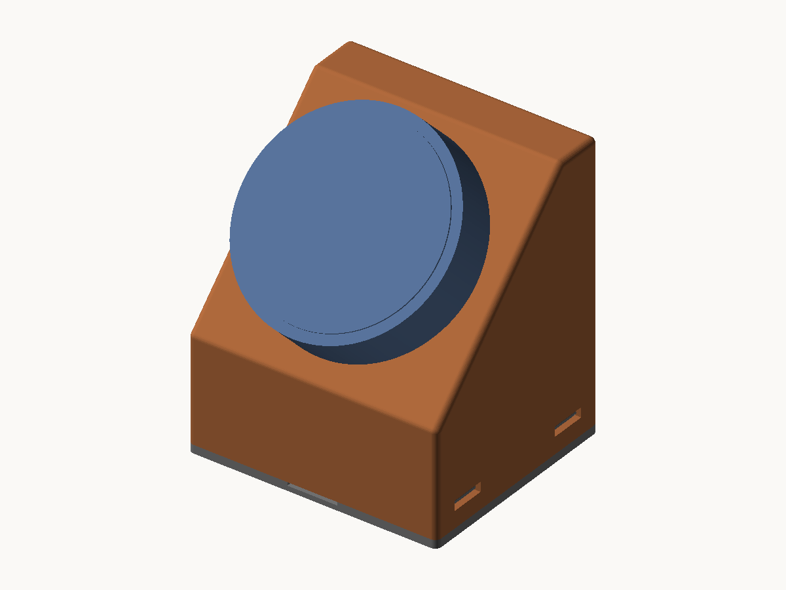
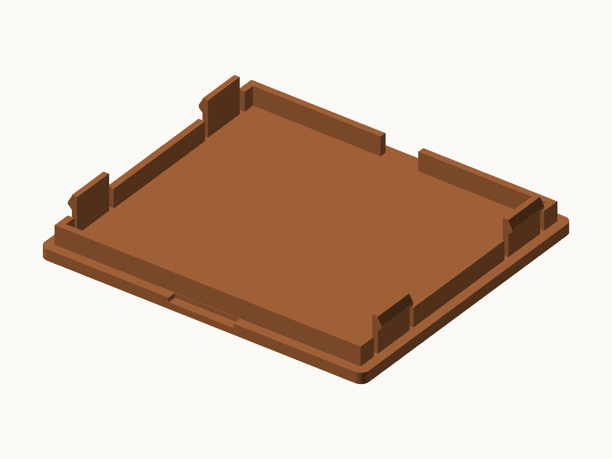
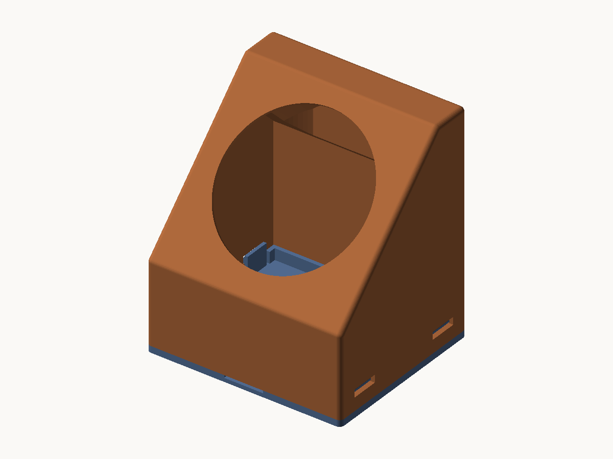
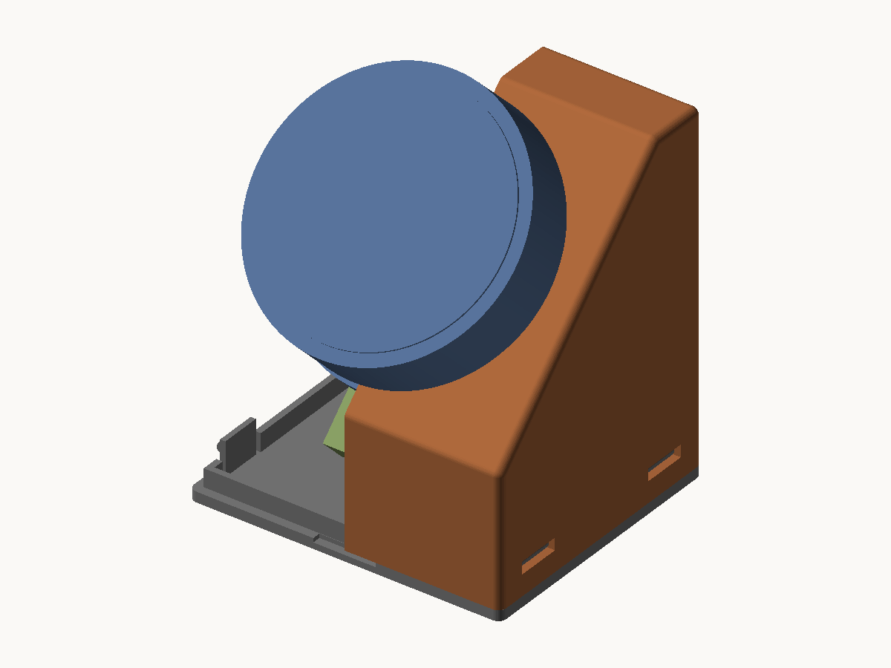

# これは何?
M5Dialをいいかんじにマウントするstlファイルだよ！

| 版 | 形 | ファイル | 外形（幅×奥行き×高さ） |
|---|---|---|---|
| **v2**（最新） | 底蓋付きの箱型・45° スロープ | `m5dial_v2_body.stl` ＋ `m5dial_v2_lid.stl` | 60 × 53 × 68.0 mm |
| v1（[リリース v1.0](https://github.com/kohnan-kitchen/M5Dial_Bracket/releases/tag/v1.0)） | 三角フレーム | `m5dial.stl` | 112 × 70 × 67 mm |

どちらも M5Dial 付属のリングナットで固定するパネルマウント方式。追加のネジ・ナットは不要。


## v2（底蓋付き・小型）



v1 の三角フレームを、底蓋で完全に閉じられる箱型に作り直した版。
構造は [m5dial-catm-gnss-stand](https://github.com/kohnan-kitchen/m5dial-catm-gnss-stand) を参考にしている。

| 部品 | ファイル | 印刷姿勢 |
|---|---|---|
| 本体（45° スロープ筐体） | `m5dial_v2_body.stl` | そのまま（設置姿勢）・サポート不要 |
| 底蓋（スナップ爪 4 本） | `m5dial_v2_lid.stl` | そのまま（板が下）・サポート不要 |

- 外形: 60 × 53 × 68.0 mm（本体 66.0 ＋底蓋 2.0）。v1（112 × 70 × 67）より幅・奥行きが小さい（高さはほぼ同じ）
- 質量: 本体 約 34 g ＋底蓋 約 9 g（PLA）。Dial 込みで約 90 g
- 斜面は 45°（水平から。画面は垂直から 45° 後傾）。斜面が始まるまでの垂直壁（台座）の高さは 25mm
- 壁厚 1.5mm、稜と角は R1.5
- 推奨: PLA / PETG、レイヤー 0.2mm、壁 4 周以上、インフィル 15–20%、サポートなし

### Dial の取り付け

斜面の壁（1.5mm）に φ45 の穴が開いている。M5Dial のネジ筒を前から差し込み、
付属のリングナットで裏から締める（v1 と同じパネルマウント。追加部品は不要）。
ナットは底の開口から手を入れて回す。

### 底蓋



- 本体と同じ平面形の板（厚 2mm）。上面のリップ（厚 1.2・高 3.5）が開口に入って位置決めする
- スナップ爪 4 本が左右の側面の小窓（8.6 × 2.35mm、各面 2 個）に掛かる。
  爪のひずみは約 1.7%
- 外すときは、前面中央の溝（幅 12）にコインを差してこじる。
  左右の小窓から爪を押し込んでもよい

### ケーブル



- M5Dial の USB-C は本体背面寄りの側面にある。Dial を回して USB-C を
  **斜面の下向き**にして取り付け、**L 字の USB-C プラグ**を挿す
  （ストレートのプラグは前壁に当たって入らない）
- ケーブルは底へ下ろし、底蓋の上面を這わせて本体背面壁の下端の出口から出す。
  出口は直線部 2 の上に半円（R3.5）が乗った U 字で、幅 7 × 高さ 5.5mm
  （USB-C ケーブル φ3.7 に約 1.8mm の余裕）。底蓋の板には切り欠きが無く、底面は平ら
  （ケーブルの位置だけリップを切ってある）
- 推測: L 字プラグの外形（幅 12 × 厚 7、根元から曲がりまで 10mm）は一般的な製品の
  概算。スクリプトはこの寸法で前壁との干渉を確認している。実際に使うケーブルで確認すること



### 組み立て

1. Dial のリングナットを外し、USB-C の L 字プラグを挿しておく
2. ケーブルを底の開口から通し、Dial を斜面の穴へ前から差し込む
   （USB-C が斜面の下側を向く角度で）
3. 底の開口から手を入れ、リングナットを手締めする
4. ケーブルを背面の出口に通し、底蓋を下から押し込んで 4 本の爪を掛ける

### 再生成

```
../.venv/bin/python m5dial_v2.py              # m5dial_v2_body.stl / m5dial_v2_lid.stl
../.venv/bin/python m5dial_v2.py --assembly   # 確認用モック（Dial・USB-C・底蓋）も出力
python3 preview.py m5dial_v2_body.stl         # プレビュー PNG
```

寸法はすべて `m5dial_v2.py` 冒頭の定数。同じ実行で次を検証する:
watertight、45°より寝た下向き面の監査、部品間の干渉（本体・底蓋・Dial・USB-C プラグ）、
Dial の締結、リングナットへの手の届き、爪のひずみ。
Dial の寸法は M5Stack 公式 STL（github.com/m5stack/M5_Hardware の K130_Dial）の実測値。

## v1（三角フレーム）

`m5dial.scad`（OpenSCAD のソース）/ `m5dial.stl`。リリース v1.0。
底面にケーブルを通す穴がある。下の写真は v1。

### 画像サンプル（v1）


## ライセンス

このプロジェクトは[MITライセンス](#license)の下で公開されています。

### MITライセンスについて

MITライセンスは、オープンソースの中でも最も寛容なライセンスの一つです。このライセンスでは、以下のことが許可されています：

- ✅ 商用利用
- ✅ 修正・改変
- ✅ 配布
- ✅ 個人利用
- ✅ サブライセンス

**唯一の条件**: 
ソフトウェアのコピーまたは重要な部分に、著作権表示とMITライセンスの全文を含めることです。

---

## LICENSE

```
MIT License

Copyright (c) 2025 Kohnan Kitchen inc.

Permission is hereby granted, free of charge, to any person obtaining a copy
of this software and associated documentation files (the "Software"), to deal
in the Software without restriction, including without limitation the rights
to use, copy, modify, merge, publish, distribute, sublicense, and/or sell
copies of the Software, and to permit persons to whom the Software is
furnished to do so, subject to the following conditions:

The above copyright notice and this permission notice shall be included in all
copies or substantial portions of the Software.

THE SOFTWARE IS PROVIDED "AS IS", WITHOUT WARRANTY OF ANY KIND, EXPRESS OR
IMPLIED, INCLUDING BUT NOT LIMITED TO THE WARRANTIES OF MERCHANTABILITY,
FITNESS FOR A PARTICULAR PURPOSE AND NONINFRINGEMENT. IN NO EVENT SHALL THE
AUTHORS OR COPYRIGHT HOLDERS BE LIABLE FOR ANY CLAIM, DAMAGES OR OTHER
LIABILITY, WHETHER IN AN ACTION OF CONTRACT, TORT OR OTHERWISE, ARISING FROM,
OUT OF OR IN CONNECTION WITH THE SOFTWARE OR THE USE OR OTHER DEALINGS IN THE
SOFTWARE.
```
